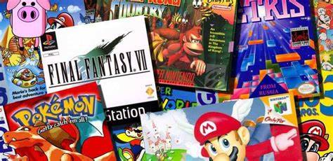

[Uploadin<!DOCTYPE HTML>
<!--
	Telephasic by HTML5 UP
	html5up.net | @ajlkn
	Free for personal and commercial use under the CCA 3.0 license (html5up.net/license)
-->
<html>
	<head>
		<title>ISRA JUEGA JUEGOS</title>
		<meta charset="utf-8" />
		<meta name="viewport" content="width=device-width, initial-scale=1, user-scalable=no" />
		<link rel="stylesheet" href="file:///C|/Mi sitio 2/assets/css/main.css" />
	</head>
	<body class="homepage is-preload">
		

			<!-- Header -->
				

					

						<!-- Logo -->
							<h1 id="logo"><a href="file:///C|/Mi sitio 2/index.html">ISRA JUEGA JUEGOS</a></h1>

						<!-- Nav -->
							<nav id="nav">
								<ul> <li>
										<a href="#">Pagina Principal </a>
										<ul>
											<li><a href="#">Donde esta 2</a></li>
											<li><a href="#">Donde esta 3</a></li>
											<li><a href="#">Donde esta 4</a></li>
											<li>
												<a href="#">Donde esta 5</a>
												<ul>
													<li><a href="#">Donde esta 6</a></li>
													<li><a href="#">Donde esta 7</a></li>
													<li><a href="#">Donde esta 8</a></li>
													<li><a href="#">Donde esta 9</a></li>
												</ul>
											</li>
											<li><a href="#">Donde esta 10</a></li>
										</ul>
									</li>
>
									
										
		              <li><a href="left-sidebar.html">TLOZ BOTW</a></li>
									<li class="break"><a href="right-sidebar.html">MINECRAFT</a></li> <li><a href="no-sidebar.html">EL OCTAVO ARTE</a></li>
									
							  </ul>
							</nav>

					

					<!-- Hero -->
						<section id="hero" class="container">
							<header>								<h2>TOP 5 VIDEOJUEGOS INFLUYENTES EN LA INDUSTRIA 

								 
								</h2>
							</header>
							
Creada como proyecto personal con proposito academico regido por profesor Erasmo Morales de Leon del plantel  <a href="http://cbta123.edu.mx/">CBTA 123 Cerritos S.L.P.</a> apoyada por deiversas paginas web y conocimientos propios 
							 
							

							<ul class="actions">
								<li><a href="#" class="button">¡VEAMOSLOS!</a></li>
							</ul>
						</section>

				

			<!-- Features 1 -->
  

					

						

							<section class="col-6 col-12-narrower feature">
							  

							    
  

						      

							  <header>
								  <h2>El exito del comienzo de una nueva leyenda  
									</h2>
								</header>
								
The legend of zelda  

								<ul class="actions">
									<li><a href="left-sidebar.html" class="button">COMIENZA LA LEYENDA</a></li>
								</ul>
							</section>
							<section class="col-6 col-12-narrower feature">
								

									
							  

								<header>
									<h2>El sandbox survival mas grande de todos los tiempos 
								  </h2>
								</header>
								
MINECRAFT

								<ul class="actions">
									<li><a href="right-sidebar.html" class="button">A crear conocimiento</a></li>
								</ul>
							</section>
						

					

				

			<!-- Promo -->
				

					<section id="promo">
						<h2>¿El nuevo arte?</h2>
						<a href="no-sidebar.html" class="button">Videojuegos</a>
					</section>
				

			<!-- Features 2 -->

					<section class="container">
						<header class="major">
							<h2>LOS 5 MEJORES</h2>
							
Ademas de los anteriore dos incluimos a estas 3 obras maestras

						</header>
						

							<section class="col-4 col-12-narrower feature">
								

									
							  

								
Blodborne

							</section>
							<section class="col-4 col-12-narrower feature">
								

									
							  

								
Skyrim

							</section>
							<section class="col-4 col-12-narrower feature">
								

									
							  

								
Red Dead Redemption 2

							</section>
						

						<ul class="actions major">
							<li><a href="#" class="button">INICIO</a></li>
						</ul>
					</section>
				

			<!-- Footer -->
				

					

						<header class="major">
							<h2>Danos tus opiniones</h2>
							
Contactanos 
							

						</header>
						

							<section class="col-6 col-12-narrower">
								<form method="post" action="#">
									

										

											<input name="name" placeholder="Name" type="text" />
										

										

											<input name="email" placeholder="Email" type="text" />
										

										

											<textarea name="message" placeholder="Message"></textarea>
										

										

											<ul class="actions">
												<li><input type="submit" value="Send Message" /></li>
												<li><input type="reset" value="Clear form" /></li>
											</ul>
										

									

								</form>
							</section>
							<section class="col-6 col-12-narrower">
								

									<ul class="divided icons col-6 col-12-mobile">
										<li class="icon brands fa-twitter"><a href="#">twitter.com/untitled</a></li>
										<li class="icon brands fa-facebook-f"><a href="#">facebook.com/untitled</a></li>
										<li class="icon brands fa-dribbble"><a href="#">dribbble.com/untitled</a></li>
									</ul>
									<ul class="divided icons col-6 col-12-mobile">
										<li class="icon brands fa-instagram"><a href="#">instagram.com/untitled</a></li>
										<li class="icon brands fa-youtube"><a href="#">youtube.com/untitled</a></li>
										<li class="icon brands fa-pinterest"><a href="#">pinterest.com/untitled</a></li>
									</ul>
								

							</section>
						

					

					

						<ul class="menu">
							<li>&copy; Todos los textos e imagenes pertenecen a derechos de autor sujetos a cambios, utilizadas en esta pagina solo con fines educativos </li><li>Design: <a href="http://html5up.net">HTML5 UP</a></li>
						</ul>
					

				

		

		<!-- Scripts -->
			
			
			
			
			
			

	</body>
</html>g index.html…]()[Uplo<!DOCTYPE HTML>
<!--
	Telephasic by HTML5 UP
	html5up.net | @ajlkn
	Free for personal and commercial use under the CCA 3.0 license (html5up.net/license)
-->
<html>
	<head>
		<title>ISRA JUEGA JUEGOS</title>
		<meta charset="utf-8" />
		<meta name="viewport" content="width=device-width, initial-scale=1, user-scalable=no" />
		<link rel="stylesheet" href="file:///C|/Mi sitio 2/assets/css/main.css" />
	</head>
	<body class="left-sidebar is-preload">
		

			<!-- Header -->
				

					

						<!-- Logo -->
							<h1 id="logo"><a href="index.html">ISRA JUEGA JUEGOS</a></h1>

						<!-- Nav -->
							<nav id="nav">
								<ul>
									<li>
										<a href="#">Mi Juego Personal Favorito</a>
										<ul>
											<li><a href="#">Donde esta 2</a></li>
											<li><a href="#">Donde esta 3</a></li>
											<li><a href="#">Donde esta 4</a></li>
											<li>
												<a href="#">Donde esta 5</a>
												<ul>
													<li><a href="#">Donde esta 6</a></li>
													<li><a href="#">Donde esta 7</a></li>
													<li><a href="#">Donde esta 8</a></li>
													<li><a href="#">Donde esta 9</a></li>
												</ul>
											</li>
											<li><a href="#">Donde esta 10</a></li>
										</ul>
									</li>
									<li><a href="left-sidebar.html">TLOZ BOTW</a></li>
									<li class="break"><a href="right-sidebar.html">MINECRAFT</a></li>
									<li><a href="no-sidebar.html">EL OCTAVO ARTE</a></li>
								</ul>
							</nav>

					

				

			<!-- Main -->
				

					

						

							

								<!-- Sidebar -->
									<section id="sidebar">
										<section>
											<header>
												<h3>CONOCEREMOS LA GENIALIDAD DE ESTA ENTREGA</h3>
											</header>
											
Ademas hablaremos de su secuela

											<ul class="actions">
												
											</ul>
										</section>
										<section>
											
										  <header>
												<h3>TEARS OF THE KINGDOM</h3>
											</header>
											
La increible secuela y la posible consagracion de BOTW al intentar alcanzar la perfeccion en esta secuela Link, una vez más se encuentra ante la obligación de encontrar a la princesa Zelda. El mundo se enfrenta a una nueva catástrofe, y sólo él puede dar con la manera de evitar que Hyrule quede arrasado.

											<ul class="actions">
												
											</ul>
										</section>
									</section>

							

							

								<!-- Content -->
									<article id="content">
										<header>
											<h2>THE LEGEND OF ZELDA BREATH OF THE WILD</h2>
											
GOTY 2017

										</header>
										
										
Por donde comenzar, este es un juego merecedor de todos los premioos que obtuvo ademas del increible reconocimiento que la critica especializada y los jugadores le dieron.

										
 Este juego llego para revolucionar la saga creada por nintendo y darle un gran renombre hasta el dia de hoy, califcado a tal grado de encontrarse repetidamente en tops de personas pocisionandolo como uno de los mejores juegos de la historia y esto porque.

										
Esto debido a su gran jugabilidad, grandes graficos, revolucionar y otorgar uno de los juegos de mundo abiertos mas completos de los videojuegos y el mapa mas grande la saga ademas de sus entrañables y miticos personajes que nos acompañaran a lo largo de esta intrepida y emocional aventura al lado de nuestro heroe link.

La histora como es de costumbre en la saga ira de tratar de rescatar a la propietaria de estas miticas leyendas de las tinieblas que invaden el nuevo mundo de "hyrule" durante la aventura nuestro heroe estara recordando y haciendo nuevos amigos que lo ayudaran a completar su aventura con una jugabilidad de dificultad media, optima para todo tipo de jugadores

									</article>

							

						

						

							<section class="col-4 col-12-narrower feature">
								

									
							  

								<header>
									<h3>BLODBORNE</h3>
								</header>
								
El mejor souls

								<ul class="actions">
									
								</ul>
							</section>
							<section class="col-4 col-12-narrower feature">
								

									
						    

								<header>
									<h3>SKYRIM</h3>
								</header>
								
El mejor rpg de mundo abierto

								<ul class="actions">
								
								</ul>
							</section>
							<section class="col-4 col-12-narrower feature">
								

									
							  

								<header>
									<h3>RED DEAD REDEMPTION 2</h3>
								</header>
								
La mejor historia y graficos

								<ul class="actions">
									
								</ul>
							</section>
						

					

				

			<!-- Footer -->
				

					

						<header class="major">
							<h2>Compartenos tu opinion</h2>
							
Contactanos 
							

						</header>
						

							<section class="col-6 col-12-narrower">
								<form method="post" action="#">
									

										

											<input name="name" placeholder="Name" type="text" />
										

										

											<input name="email" placeholder="Email" type="text" />
										

										

											<textarea name="message" placeholder="Message"></textarea>
										

										

											<ul class="actions">
												<li><input type="submit" value="Send Message" /></li>
												<li><input type="reset" value="Clear form" /></li>
											</ul>
										

									

								</form>
							</section>
							<section class="col-6 col-12-narrower">
								

									<ul class="divided icons col-6 col-12-mobile">
										<li class="icon brands fa-twitter"><a href="#">twitter.com/untitled</a></li>
										<li class="icon brands fa-facebook-f"><a href="#">facebook.com/untitled</a></li>
										<li class="icon brands fa-dribbble"><a href="#">dribbble.com/untitled</a></li>
									</ul>
									<ul class="divided icons col-6 col-12-mobile">
										<li class="icon brands fa-instagram"><a href="#">instagram.com/untitled</a></li>
										<li class="icon brands fa-youtube"><a href="#">youtube.com/untitled</a></li>
										<li class="icon brands fa-pinterest"><a href="#">pinterest.com/untitled</a></li>
									</ul>
								

							</section>
						

					

					

						<ul class="menu">
							<li>&copy; Imagenes y textos ligadas a derechos de autor.</li><li>Design: <a href="http://html5up.net">HTML5 UP</a></li>
						</ul>
					

				

		

		<!-- Scripts -->
			
			
			
			
			
			

	</body>
</html>ading left-sidebar.html…]()[Uploa<!DOCTYPE HTML>
<!--
	Telephasic by HTML5 UP
	html5up.net | @ajlkn
	Free for personal and commercial use under the CCA 3.0 license (html5up.net/license)
-->
<html>
	<head>
		<title>EL OCTAVO ARTE</title>
		<meta charset="utf-8" />
		<meta name="viewport" content="width=device-width, initial-scale=1, user-scalable=no" />
		<link rel="stylesheet" href="file:///C|/Mi sitio 2/assets/css/main.css" />
	</head>
	<body class="no-sidebar is-preload">
		

			<!-- Header -->
				

					

						<!-- Logo -->
							<h1 id="logo"><a href="index.html">ISRA JUEGA JUEGOS</a></h1>

						<!-- Nav -->
							<nav id="nav">
								<ul>
									<li>
										<a href="#">El Arte es Subjeivo</a>
										<ul>
											<li><a href="#">Lorem ipsum dolor</a></li>
											<li><a href="#">Magna phasellus</a></li>
											<li><a href="#">Etiam dolore nisl</a></li>
											<li>
												<a href="#">Phasellus consequat</a>
												<ul>
													<li><a href="#">Lorem ipsum dolor</a></li>
													<li><a href="#">Phasellus consequat</a></li>
													<li><a href="#">Magna phasellus</a></li>
													<li><a href="#">Etiam dolore nisl</a></li>
												</ul>
											</li>
											<li><a href="#">Donde esta 1</a></li>
										</ul>
									</li>
									<li><a href="left-sidebar.html">TLOZ BOTW</a></li>
									<li class="break"><a href="right-sidebar.html">MINECRAFT</a></li>
									<li><a href="no-sidebar.html">EL OCTAVO ARTE</a></li>
								</ul>
							</nav>

					

				

			<!-- Main -->
				

					

						<!-- Content -->
							<article id="content">
								<header>
									<h2>¿LOS VIDEOJUEGOS SON ARTE?</h2>
									
El arte en todas partes

								</header>
								
						    
La RAE define arte como: "manifestación de la actividad humana mediante la cual se interpreta lo real o se plasma lo imaginado con recursos plásticos, lingüísticos o sonoros". 

								
Entonces pensamos, ¿en realidad los videojuegos se pueden considerar como arte o no? a mi punto de vista la respuesta es SI, ya que en lo personal e logrado ver grandes paisajes, e experimentado grandes historias, incluso hemos escuchado sinfonias hermosas que acompañan todo lo anterior danos un sentimiento de imersion tan agradable en ciertos casos que incluso nos detenemos solo para apreciar la obra que estamos presenciando de manera personal.

								
Los videojuegos son considerados una forma de arte por la comunidad artística y académica1. Los videojuegos son capaces de combinar diferentes disciplinas artísticas, como el diseño visual, la música y la narrativa, para crear experiencias únicas y expresivas. Los museos de arte han exhibido retrospectivamente juegos de primera y segunda generación obsoletos. El Ministro de Cultura francés caracterizó a los videojuegos como bienes culturales y como una forma de expresión artística

							</article>

						

							<section class="col-4 col-12-narrower feature">
								

									
							  

								<header>
									<h3>BLODBORNE</h3>
								</header>
								
Explora el arte de este juego en su arquitectura gotica y sus paisajes en una atmosfera oscura

								<ul class="actions">
									
								</ul>
							</section>
							<section class="col-4 col-12-narrower feature">
								

									
							  

								<header>
									<h3>SKYRIM</h3>
								</header>
								
Observa el arte en increibles paisajes llenos de fantasia ademas de grandes historias fantasticas guiadas por la cultura nordica, acompañadas de grandes piezas musicales.

								<ul class="actions">
									
								</ul>
							</section>
							<section class="col-4 col-12-narrower feature">
								

									
							  

								<header>
									<h3>RED DEAD REDEMPTION</h3>
								</header>
								
Adentrate en el arte del paisajismo rojo del viejo oeste con una gran historia digna de una pelicula western.

								<ul class="actions">
									
								</ul>
							</section>
						

					

				

			<!-- Footer -->
				

					

						<header class="major">
							<h2>Envianos tus comentarios</h2>
							
Sigue nuestras redes sociales 
							
						</header>
						

							<section class="col-6 col-12-narrower">
								<form method="post" action="#">
									

										

											<input name="name" placeholder="Name" type="text" />
										

										

											<input name="email" placeholder="Email" type="text" />
										

										

											<textarea name="message" placeholder="Message"></textarea>
										

										

											<ul class="actions">
												<li><input type="submit" value="Send Message" /></li>
												<li><input type="reset" value="Clear form" /></li>
											</ul>
										

									

								</form>
							</section>
							<section class="col-6 col-12-narrower">
								

									<ul class="divided icons col-6 col-12-mobile">
										<li class="icon brands fa-twitter"><a href="#">twitter.com/untitled</a></li>
										<li class="icon brands fa-facebook-f"><a href="#">facebook.com/untitled</a></li>
										<li class="icon brands fa-dribbble"><a href="#">dribbble.com/untitled</a></li>
									</ul>
									<ul class="divided icons col-6 col-12-mobile">
										<li class="icon brands fa-instagram"><a href="#">instagram.com/untitled</a></li>
										<li class="icon brands fa-youtube"><a href="#">youtube.com/untitled</a></li>
										<li class="icon brands fa-pinterest"><a href="#">pinterest.com/untitled</a></li>
									</ul>
								

							</section>
						

					

					

						<ul class="menu">
							<li>&copy; Untitled. All rights reserved.</li><li>Design: <a href="http://html5up.net">HTML5 UP</a></li>
						</ul>
					

				

		

		<!-- Scripts -->
			
			
			
			
			
			

	</body>
</html>ding no-sidebar.html…]()[Uplo<!DOCTYPE HTML>
<!--
	Telephasic by HTML5 UP
	html5up.net | @ajlkn
	Free for personal and commercial use under the CCA 3.0 license (html5up.net/license)
-->
<html>
	<head>
		<title>MINECRAFT</title>
		<meta charset="utf-8" />
		<meta name="viewport" content="width=device-width, initial-scale=1, user-scalable=no" />
		<link rel="stylesheet" href="file:///C|/Mi sitio 2/assets/css/main.css" />
	</head>
	<body class="right-sidebar is-preload">
		

			<!-- Header -->
				

					

						<!-- Logo -->
							<h1 id="logo"><a href="index.html">ISRA JUEGA JUEGOS</a></h1>

						<!-- Nav -->
							<nav id="nav">
								<ul>
									<li>
										<a href="#">Maikra</a>
										<ul>
											<li><a href="#">Donde esta 3</a></li>
											<li><a href="#">Donde esta 4</a></li>
											<li><a href="#">Donde esta 5</a></li>
											<li>
												<a href="#">Donde esta 6</a>
												<ul>
													<li><a href="#">Lorem ipsum dolor</a></li>
													<li><a href="#">Phasellus consequat</a></li>
													<li><a href="#">Magna phasellus</a></li>
													<li><a href="#">Etiam dolore nisl</a></li>
												</ul>
											</li>
											<li><a href="#">Donde esta 10</a></li>
										</ul>
									</li>
									<li><a href="left-sidebar.html">TLOZ BOTW</a></li>
									<li class="break"><a href="right-sidebar.html">MINECRAFT</a></li>
									<li><a href="no-sidebar.html">EL OCTAVO ARTE</a></li>
								</ul>
							</nav>

					

				

			<!-- Main -->
				

					

						

							

								<!-- Content -->
									<article id="content">
										<header>
											<h2>	Minecraft</h2>
											
El limite es tu imaginacion

										</header>
										
										
Álvaro San Martín, un auténtico experto en Minecraft, nos ofrece un análisis crítico de este juego. Minecraft, desarrollado por Mojang AB, es un excelente simulador de vida. Su atractivo radica en su capacidad para fomentar la creatividad, la exploración y la resolución de problemas.
A través de sus mecánicas, Minecraft nos convierte a todos en hacedores y arquitectos de un sueño que nunca terminaremos de construir. Es como una cubeta inagotable de Legos, donde cada bloque es una oportunidad para crear. En el modo de un jugador, esta experiencia se vuelve bella y desoladora. Construir en solitario en medio de una superficie de juego infinita, mientras suena la relajante melodía de "Subwoofer Lullaby", genera un sentimiento único e irreproducible por cualquier otra forma de arte.
"kraft" (sin traducción directa al español) encapsula la idea de una fuerza fundamental y esencial que nos conecta a todos. En Minecraft, somos instrumentos de esta fuerza, moldeando desesperadamente el universo a nuestra imagen.

										
Minecraft como jugador y experiencia personal lo tomaria sin duda como un videojuego si tuviera que jugar algo por el resto de mi vida, esto gracias a la inmensidad de su mundo y la gran posibilidad de crear y destruir cosas en el que el unico limite es nuestra imaginacion

										

									</article>

							

							

								<!-- Sidebar -->
									<section id="sidebar">
										<section>
											<header>
												<h3>¿SABIAS QUE?</h3>
											</header>
											

											<ul class="actions">
												
										  </ul>
										</section>
										<section>
											
										  <header>
												<h3>Minecraft es el videojuego mas vendido de la historia por encima de tetris</h3>
										
											</ul>
										</section>
									</section>

							

						

						

							<section class="col-4 col-12-narrower feature">
								

									
							  

								<header>
									<h3>BLODBORNE</h3>
								</header>
								
El juego tipo souls mejor hecho por "from software".

								<ul class="actions">
									
								</ul>
							</section>
							<section class="col-4 col-12-narrower feature">
								

									
							  

								<header>
									<h3>Skyrim</h3>
								</header>
								
El videojuego que revoluciono los rpg's y los mundos abiertos

								<ul class="actions">
									
								</ul>
							</section>
							<section class="col-4 col-12-narrower feature">
								

									
							  

								<header>
									<h3>RED DEAD REDEMPTION</h3>
								</header>
								
La obra maestra de rockstar games.

								<ul class="actions">
									
							  </ul>
							</section>
						

					

				

			<!-- Footer -->
				

					

						<header class="major">
							<h2>Compartenos tu opinion al respecto</h2>
							
Escribe y contactanos a nuestras redes sociales 
							
						</header>
						

							<section class="col-6 col-12-narrower">
								<form method="post" action="#">
									

										

											<input name="name" placeholder="Name" type="text" />
										

										

											<input name="email" placeholder="Email" type="text" />
										

										

											<textarea name="message" placeholder="Message"></textarea>
										

										

											<ul class="actions">
												<li><input type="submit" value="Send Message" /></li>
												<li><input type="reset" value="Clear form" /></li>
											</ul>
										

									

								</form>
							</section>
							<section class="col-6 col-12-narrower">
								

									<ul class="divided icons col-6 col-12-mobile">
										<li class="icon brands fa-twitter"><a href="#">twitter.com/untitled</a></li>
										<li class="icon brands fa-facebook-f"><a href="#">facebook.com/untitled</a></li>
										<li class="icon brands fa-dribbble"><a href="#">dribbble.com/untitled</a></li>
									</ul>
									<ul class="divided icons col-6 col-12-mobile">
										<li class="icon brands fa-instagram"><a href="#">instagram.com/untitled</a></li>
										<li class="icon brands fa-youtube"><a href="#">youtube.com/untitled</a></li>
										<li class="icon brands fa-pinterest"><a href="#">pinterest.com/untitled</a></li>
									</ul>
								

							</section>
						

					

					

						<ul class="menu">
							<li>&copy; Imagenes y textos ligadas a derechos de autor.</li><li>Design: <a href="http://html5up.net">HTML5 UP</a></li>
						</ul>
					

				

		

		<!-- Scripts -->
			
			
			
			
			
			

	</body>
</html>ading right-sidebar.html…](
)

